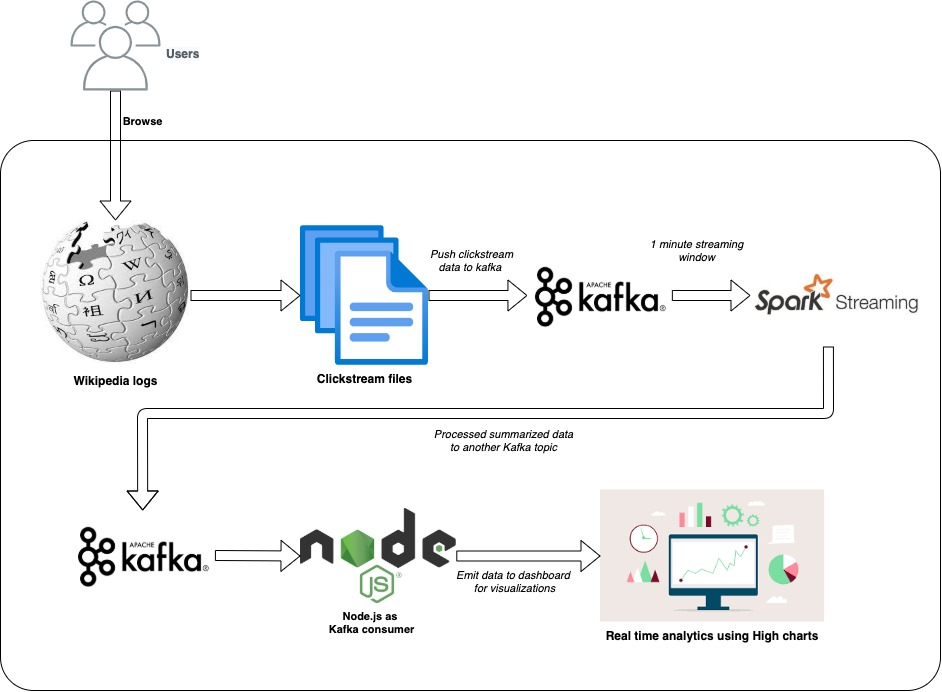

# Wikipedia Clickstream Analysis using Apache Kafka, Spark streaming and Node.Js

The Wikipedia Clickstream dataset contains counts of (referrer, resource) pairs extracted from the request logs of Wikipedia. 

Download appropriate dataset from: https://dumps.wikimedia.org/other/clickstream/

For e.g. https://dumps.wikimedia.org/other/clickstream/2021-05/clickstream-enwiki-2021-05.tsv.gz 

### Sample data:
|prev|curr|link|n|
|----|----|----|----|
other-search |	Scharnegoutum	| external	| 12
Drew_Dober	| UFC_Fight_Night:_Muñoz_vs._Mousasi |	link |	26

## Architecture



## Software Setup:
> Pre requisite: Java 8, node should be installed.

1. Setup Kafka
   
   - Download Apache Kafka from https://kafka.apache.org/downloads .Latest version as of Sep 2021 is kafka_2.13-2.8.0.tgz. Direct wownload link :https://www.apache.org/dyn/closer.cgi?path=/kafka/2.8.0/kafka_2.13-2.8.0.tgz

   - Start kafka locally by following following steps:

        ```bash
        $ tar -xzf kafka_2.13-2.8.0.tgz
        $ cd kafka_2.13-2.8.0

        # Start the ZooKeeper service in a terminal
        $ bin/zookeeper-server-start.sh config/zookeeper.properties

        # Start the Kafka broker service in another ternimal
        $ bin/kafka-server-start.sh config/server.properties
        ```
2. Create topics in kafka
```
   #Open a new terminal and create a topic named wikistream to hold the clickstream data
   bin/kafka-topics.sh --create --topic wikistream --bootstrap-server localhost:9092

   #create another topic named top_resource to store processed data for top accessed pages
   bin/kafka-topics.sh --create --topic top_resource --bootstrap-server localhost:9092
```
3. Setup Spark
   - Download spark from https://spark.apache.org/downloads.html Direct link: https://www.apache.org/dyn/closer.lua/spark/spark-3.1.2/spark-3.1.2-bin-hadoop3.2.tgz
   - Extract spark
        ```
        tar -xzf spark-3.1.2-bin-hadoop3.2.tgz 
        cd spark-3.1.2-bin-hadoop3.2
        ```
4. Setup Node.js
    ```bash
    # Open a new terminal and go to node directory 
    cd node

    # Install dependencies as specified in package.json
    npm install
    ```
    
## Start the services:
1. Start expressjs server 
   ```bash
   node index
   ```
2. Start spark shell in a seperate terminal
   ```
   bin/spark-shell --packages org.apache.spark:spark-sql-kafka-0-10_2.12:3.1.2
   ```
3. Paste following code in the spark shell to perform strreaming with kafka
   > Note: can use :paste on shell to enter paste mode
   ```scala
    import scala.util.Try
    case class WikiClickstream(prev: String, curr: String, link: String, n: Long)

    def parseVal(x: Array[Byte]): Option[WikiClickstream] = {
        val split: Array[String] = new Predef.String(x).split("\\t")
        if (split.length == 4) {
        Try(WikiClickstream(split(0), split(1), split(2), split(3).toLong)).toOption
        } else
        None
        }
   ```
    Read from kafka topic named `wikistream`
   ```scala
    val records = spark.readStream.format("kafka")
                        .option("subscribe", "wikistream")
                        .option("failOnDataLoss", "false")
                        .option("kafka.bootstrap.servers", "localhost:9092").load()
    ```
    Do some aggregation on streaming dataframe 
    ```scala
    val messages = records.select("value").as[Array[Byte]]
                        .flatMap(x => parseVal(x))
                        .groupBy("curr")
                        .agg(Map("n" -> "sum"))
                        .sort($"sum(n)".desc)
    ```
    Send the processed data to Kafka sink. topic name `top_resource`
    Create a folder for checkpoint somewhere. For e.g /tmp/spark_checkpoint and set for checkpointDir below
    ```scala
    val messages2 = messages.withColumn("curr",messages("curr").cast("string")).withColumn("sum(n)",messages("sum(n)").cast("string")).withColumnRenamed("curr","key").withColumnRenamed("sum(n)","value")

    val checkpointDir = “/tmp/spark_checkpoint”
    val kafkaSink = messages2.writeStream
        .format("kafka")
        .option("kafka.bootstrap.servers", "localhost:9092")
        .option("topic", "top_resource")
        .option("checkpointLocation", checkpointDir)
        .outputMode("complete")
        .start()
   ```

4.  Open browser http://localhost:3000/
5.  Start streaming wiki clickstream data in `wikistream` topic
    ```bash
    cd kafka_2.13-2.8.0
    #just reading last 200 lines from wiki clickstream file
    tail -200 ../data/clickstream-enwiki-2021-05.tsv | bin/kafka-console-producer.sh --broker-list localhost:9092 --topic wikistream --producer.config=config/producer.properties
    ```
6. Notice the browser console for the messages from kafka wikistream topic. 
   Sample output
   ```
    Sea_Around_Us_(organization) 228
    AT&T_Pogo 376
    San_Juan_de_Rioseco 204
    Thamudic_B 408
    Legazpi_(Madrid) 192
    NoitulovE 504
    Titiribí 212
    New_Mexico_Bank_&_Trust_Building 248
    Beryl_Smalley 212
    Naiane_Rios 80
    Judith_Ackland 168
    Scharnegoutum 48
    Mar_'Ukban_III_(exilarch) 88
    Peter_Larisch 56

   ```
7. TODO: Display data in charts.
