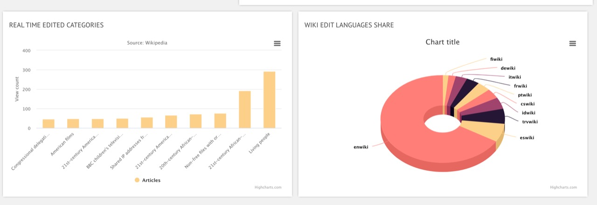
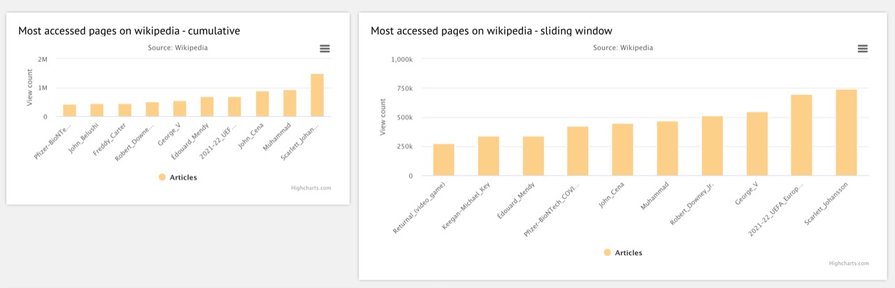

# Wikipedia Clickstream Analysis using Apache Kafka, Spark streaming and Node.Js

The Wikipedia Clickstream dataset contains counts of (referrer, resource) pairs extracted from the request logs of Wikipedia. 

Download appropriate dataset from: https://dumps.wikimedia.org/other/clickstream/

For e.g. https://dumps.wikimedia.org/other/clickstream/2021-05/clickstream-enwiki-2021-05.tsv.gz 

### Sample data:
|prev|curr|link|n|
|----|----|----|----|
other-search |	Scharnegoutum	| external	| 12
Drew_Dober	| UFC_Fight_Night:_Muñoz_vs._Mousasi |	link |	26

## Wikipedia EventStreams [event](https://wikitech.wikimedia.org/wiki/Event_Platform/EventStreams)  
https://stream.wikimedia.org/v2/stream/recentchange

Sample record:
```
{"$schema":"/mediawiki/recentchange/1.0.0","meta":{"uri":"https://uk.wikipedia.org/wiki/Euphrasia_wettsteinii","request_id":"34593d2f-68ef-4dbc-94b4-8f297e90a55f","id":"cf5daedf-12b5-45cd-9716-347966a9768e","dt":"2021-09-17T14:36:50Z","domain":"uk.wikipedia.org","stream":"mediawiki.recentchange","topic":"eqiad.mediawiki.recentchange","partition":0,"offset":3303899900},"id":120497382,"type":"edit","namespace":0,"title":"Euphrasia wettsteinii","comment":"Speciesbox","timestamp":1631889410,"user":"Sehrg","bot":false,"minor":false,"length":{"old":7557,"new":6913},"revision":{"old":32692884,"new":33445941},"server_url":"https://uk.wikipedia.org","server_name":"uk.wikipedia.org","server_script_path":"/w","wiki":"ukwiki","parsedcomment":"Speciesbox"}
```

## Architecture


## Software Setup:
> Pre requisite: Java 8, node should be installed.

1. Setup Kafka
   
   - Download Apache Kafka from https://kafka.apache.org/downloads .Latest version as of Sep 2021 is kafka_2.13-2.8.0.tgz. Direct wownload link :https://www.apache.org/dyn/closer.cgi?path=/kafka/2.8.0/kafka_2.13-2.8.0.tgz

   - Start kafka locally by following following steps:

        ```bash
        $ tar -xzf kafka_2.13-2.8.0.tgz
        $ cd kafka_2.13-2.8.0
        $ export KAFKA_HOME=/Users/MPDS_Project/Wikipedia/kafka_2.13-2.8.0

        # Start the ZooKeeper service in a terminal. Keep the terminal running
        $ $KAFKA_HOME/bin/zookeeper-server-start.sh config/zookeeper.properties

        # Start the Kafka broker service in another ternimal. Keep the terminal running
        $ $KAFKA_HOME/bin/kafka-server-start.sh config/server.properties
        ```
2. Create topics in kafka
   Checkout this git repo. Go to this git repo root.
   
```
cd wikipedia-clickstream-analysis/
export KAFKA_HOME=/Users/MPDS_Project/Wikipedia/kafka_2.13-2.8.0

chmod 755 ./kafka/init_kafka.sh
./kafka/init_kafka.sh

```
1. Setup Spark
   - Download spark from https://spark.apache.org/downloads.html Direct link: https://www.apache.org/dyn/closer.lua/spark/spark-3.1.2/spark-3.1.2-bin-hadoop3.2.tgz
   - Extract spark
        ```
        tar -xzf spark-3.1.2-bin-hadoop3.2.tgz 
        cd spark-3.1.2-bin-hadoop3.2
        ```
1. Setup Node.js
   
   Go to this git repo root.
    ```bash
    # Open a new terminal and go to node directory of this git repo
    cd node

    # Install dependencies as specified in package.json
    npm install
    ```
    
## Start the services:
1. Start expressjs server 
   ```bash
   node index
   ```
2. Start spark shell in a seperate terminal.  
   ```
   #cd spark-3.1.2-bin-hadoop3.2
   export SPARK_HOME=/Users/MPDS_Project/Wikipedia/spark-3.1.2-bin-hadoop3.2
   $SPARK_HOME/bin/spark-shell --packages org.apache.spark:spark-sql-kafka-0-10_2.12:3.1.2
   ```
   > If spark process gets killed due to Out of Memory error, increase memory and run spark shell as follows:
   ```
   $SPARK_HOME/bin/spark-shell --driver-memory 3G --num-executors 5 --executor-cores 2 --executor-memory 3G --conf spark.driver.maxResultSize=2G --packages org.apache.spark:spark-sql-kafka-0-10_2.12:3.1.2
   
   :load /Users/MPDS_Project/Wikipedia/wikipedia-clickstream-analysis/spark/eventwikiProcessing.scala

   ```
   Keep the terminal running
   

3.  Open browser http://localhost:3000/  (new dashboard at http://localhost:3000/chart.html )
4.  Start streaming wiki clickstream data in `wikistream` topic. Below steps will stream 200 records in the system.
    ```bash
    cd kafka_2.13-2.8.0
    #just reading last 200 lines from wiki clickstream file
    tail -200 ../data/clickstream-enwiki-2021-05.tsv | bin/kafka-console-producer.sh --broker-list localhost:9092 --topic wikistream --producer.config=config/producer.properties
    ```
    > To stream *all* records , use following steps: The script streams a 50K records file every 30 seconds into the system
      ```
      # update the export path appropriately to directory where kakfa was installed. Note this directory will have the bin folder.
      export KAFKA_HOME=/Users/MPDS_Project/Wikipedia/kafka_2.13-2.8.0
      ```

   ```bash

      cd data
      # assuming wiki file is extracted here as clickstream-enwiki-2021-05.tsv. (Check and update the extracted file name below).
      mkdir split
      split -l 50000 -d data/clickstream-enwiki-2021-05.tsv data/split/clickstream-enwiki-2021-05
      bash push_files_into_topic.sh split localhost:9092 wikistream

   ```
5. Start streaming event data in `wikievent` topic. This is a live stream.
   ```
   cd node
   node event_process.js

   ```

6. Notice the browser console for the messages from kafka wikistream topic. 
   Sample output
   ```
    Sea_Around_Us_(organization) 228
    AT&T_Pogo 376
    San_Juan_de_Rioseco 204
    Thamudic_B 408
    Legazpi_(Madrid) 192
    NoitulovE 504
    Titiribí 212
    New_Mexico_Bank_&_Trust_Building 248
    Beryl_Smalley 212
    Naiane_Rios 80
    Judith_Ackland 168
    Scharnegoutum 48
    Mar_'Ukban_III_(exilarch) 88
    Peter_Larisch 56

   ```

   Output of `wikievent` tpoic
   ```
   event_wikitype frwiki 25
   event_top_categories 1993 births 15
   event_top_categories Wikipedia Teahouse 5
   event_top_categories Wikipedia help forums 13
   event_top_categories Templates using TemplateStyles 23
   ```
7. Monitor the charts. It will update every few seconds as new records arrive.





8. Maintenance: To start fresh, clear the topics as follows
   ```bash
   #1. Kill the kafka server. Start again with this additional parameter of delete.topic.enable
      bin/kafka-server-start.sh config/server.properties \
      --override delete.topic.enable=true

   #2. Delete all the topics.

      $KAFKA_HOME/bin/kafka-topics.sh \
      --delete --topic wikistream \
      --zookeeper localhost:2181

      $KAFKA_HOME/bin/kafka-topics.sh \
      --delete --topic top_resource \
      --zookeeper localhost:2181
      
      $KAFKA_HOME/bin/kafka-topics.sh \
      --delete --topic top_resource_sliding \
      --zookeeper localhost:2181

      $KAFKA_HOME/bin/kafka-topics.sh \
      --delete --topic wikievent \
      --zookeeper localhost:2181

      $KAFKA_HOME/bin/kafka-topics.sh \
      --delete --topic event_top_categories \
      --zookeeper localhost:2181

      $KAFKA_HOME/bin/kafka-topics.sh \
            --delete --topic event_wikitype \
            --zookeeper localhost:2181

   #3 Delete spark checkpoints
      rm -rf /tmp/spark_checkpoint*

   #4 Restart spark and node.js apps
   ```
